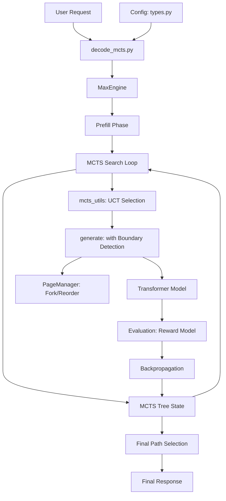

# Design Document: JAX-MCTS (Tree of Thoughts) for MaxText

This document outlines the high-level design for implementing a Monte Carlo Tree Search (MCTS) decoding strategy in MaxText, inspired by the paper *"Tree of Thoughts: Deliberate Problem Solving with Large Language Models"* (Yao et al., 2023).

---

## 1. Overview
The goal is to enable "Deliberate Reasoning" by allowing the model to explore multiple branching paths of "thoughts." Unlike standard greedy or beam search, JAX-MCTS uses a principled search algorithm to evaluate the potential of different reasoning steps and prioritize exploration of promising paths.

---

## 2. System Architecture

---

## 3. Core Components

### 3.1 `decode_mcts.py` (Entry Point)
A new inference script that initializes the `MaxEngine` and replaces the standard greedy loop with the `MCTSTreeSearch` loop. It handles search configuration parameters like `mcts_simulations` and `thought_limit`.

### 3.2 Modified `MaxEngine`
The engine is updated to handle the **MCTS Search Loop**. It manages the `DecodeState` and coordinates the transition between different tree branches.
*   **Modified `generate()`**: Now includes **Boundary Detection** to stop at "End of Thought" (EOT) signals like `\n`.

### 3.3 `mcts_utils.py` (Functional Logic)
Contains the core mathematical logic for the search:
*   **UCT Selection**: Calculates Upper Confidence Bound scores to balance exploration/exploitation.
*   **Backpropagation**: Updates the running average of values and visit counts for all nodes on a path.

### 3.4 Paged Attention & `PageManager`
Critical for **Prefix Sharing**. When the search "jumps" to a child or sister branch, the `PageManager` performs an O(1) "memory restore" by updating the `page_map` to point to the shared history, avoiding redundant computation.

---

## 4. The MCTS Cycle

1.  **Selection**: Starting from the root node, the algorithm uses the **UCT Formula** to select the most "interesting" path until a leaf node is reached.
    $$UCT(n) = \frac{W(n)}{N(n)} + C \sqrt{\frac{\ln N(parent)}{N(n)}}$$
2.  **Expansion**: The selected leaf node is expanded. The model generates tokens until it hits a **Thought Boundary** (e.g., a newline). This creates one or more new child nodes.
3.  **Evaluation**: Instead of a "Random Rollout," a **Reward Model** or **Self-Evaluation prompt** is used to assign a score to the new thought. This score acts as the "Estimated Future Value."
4.  **Backpropagation**: The evaluation score and the visit count (+1) are propagated from the leaf back up to the root, updating the **running average** reputation of every node on that path.

---

## 5. Key Implementation Details

### Thought Boundaries
Thoughts are logically encapsulated "steps" in reasoning.
*   **Primary Boundary**: Newline character (`\n`).
*   **Fallback**: Maximum token length per thought (e.g., 64 tokens) or terminal `<|EOS|>` token.

### KV Cache Management
To handle the branching nature of the tree, the system "checkpoints" the `PageState` at every node. When a node is selected for expansion, its parent's `page_map` is forked, allowing the new generation to resume exactly where the parent thought ended.

### Termination & Decision
1.  **Search Budget**: The loop continues for a fixed number of simulations or until a time timeout is hit.
2.  **Final Path**: After the search budget is exhausted, the algorithm selects the child of the root with the **Highest Visit Count** ($N$) and follows the "most visited" path to produce the final output.

---

## 6. Future Enhancements
*   **Value Head**: Integrating a trained value head directly into the Transformer architecture for zero-overhead scoring.
*   **Process Reward Models (PRM)**: Using specialized models trained to verify step-by-step reasoning.
*   **Batched MCTS**: Running multiple parallel selections and expansions in a single TPU pass to maximize throughput.
