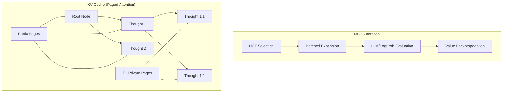

To implement **JAX-MCTS** (Monte Carlo Tree Search) inspired by the **Tree of Thoughts (ToT)** paper in the MaxText repository, we need to leverage MaxText's high-performance JAX infrastructure, specifically its **Paged Attention** and **replicated/sharded inference** capabilities.

The core idea is to treat the decoding process as a tree search where each node represents a "thought" (a block of generated tokens). We use MCTS to navigate this tree, expanding promising thoughts and evaluating them using the model itself.

### 1. High-Level Architecture

The design consists of three primary layers:
1.  **Search Logic**: Vectorized MCTS implemented in JAX (UCT selection, expansion, backpropagation).
2.  **State Management**: A Paged Attention-based KV cache that supports **prefix sharing** (multiple child nodes sharing the same parent memory).
3.  **Inference Integration**: Utilizing [MaxEngine](cci:2://file:///Users/kevinwang/Projects/maxtext/src/maxtext/inference/maxengine/maxengine.py:99:0-1893:29) to perform batched thought generation and evaluation.

---

### 2. Proposed Data Structures

#### `MCTSTree` (JAX Pytree)
To remain JIT-friendly, the tree must have a fixed maximum number of nodes (`MAX_NODES`).
*   `parent_ids`: `[MAX_NODES]` — Index of the parent node.
*   `children`: `[MAX_NODES, EXPANSION_FACTOR]` — Indices of child nodes.
*   `visit_counts`: `[MAX_NODES]` — Number of times a node has been visited.
*   `values`: `[MAX_NODES]` — Accumulated value (score) of the node.
*   `node_tokens`: `[MAX_NODES, THOUGHT_LEN]` — The tokens generated for this specific thought.
*   `node_depth`: `[MAX_NODES]` — Depth in the tree.
*   `page_group_ids`: `[MAX_NODES]` — Mapping of wood index to a [PageManager](cci:2://file:///Users/kevinwang/Projects/maxtext/src/maxtext/inference/page_manager.py:388:0-594:5) slot.

---

### 3. Core Implementation Components

#### A. Prefix Sharing via Paged Attention
The most critical part for efficiency is avoiding redundant KV cache computation.
*   **Forking**: When expanding Node A into children B and C, we "fork" the `page_map` of A.
*   **Logic**: `page_map[slot_B] = page_map[slot_A]`. Only when B generates *new* tokens does it allocate its own private pages in the [PageManager](cci:2://file:///Users/kevinwang/Projects/maxtext/src/maxtext/inference/page_manager.py:388:0-594:5).
*   **Modification**: Add a `fork_page_group(state, src_slot, dest_slot)` method to `PageManager.py`.

#### B. The Search Loop (`jax.lax.while_loop`)
The entire MCTS process should be encapsulated in a single JIT-compiled loop:
1.  **Selection**: Use vectorized **UCT (Upper Confidence Bounds for Trees)** to pick the most promising leaf node.
    - $UCT(n) = \frac{V(n)}{N(n)} + c \sqrt{\frac{\ln N(parent)}{N(n)}}$
2.  **Expansion**: Call `MaxEngine.generate` for $K$ steps to create $K$ new thought candidates.
3.  **Evaluation**: ToT uses LLMs as evaluators. Two ways to implement:
    - **Self-Likelihood**: Use the average log-probability of the generated thought.
    - **Prompt-based**: Run a quick inference pass with a "Value Prompt" (e.g., "Rate this thought from 1-10").
4.  **Backpropagation**: Update `visit_counts` and `values` from the new leaf up to the root.

#### C. Batching Simulations
Standard MCTS is sequential. To saturate TPUs, we should implement **Batched MCTS**:
*   Selection picks $B$ (batch size) nodes to expand in parallel.
*   Use `jax.vmap` or `jax.lax.map` over the `MaxEngine.generate` calls for the chosen nodes.

---

### 4. Integration Workflow

1.  **Extend Config**: Add MCTS/ToT parameters to [src/maxtext/configs/types.py](cci:7://file:///Users/kevinwang/Projects/maxtext/src/maxtext/configs/types.py:0:0-0:0).
    - `mcts_num_simulations`, `mcts_expansion_factor`, `thought_length`, `exploration_constant`.
2.  **New Utility `mcts_utils.py`**:
    - Implement Pytree-based tree operations.
    - Vectorized UCT and Backprop functions.
3.  **New Entry Point `decode_mcts.py`**:
    - A script similar to [decode.py](cci:7://file:///Users/kevinwang/Projects/maxtext/src/maxtext/inference/decode.py:0:0-0:0) that initializes the `MCTSTree` and runs the search loop.
4.  **Update [MaxEngine](cci:2://file:///Users/kevinwang/Projects/maxtext/src/maxtext/inference/maxengine/maxengine.py:99:0-1893:29)**:
    - Introduce a `generate_thought` method that handles paged allocation for a specific tree node's expansion.

### 5. Mermaid Design Diagram

### Next Steps Recommendation
1.  **Start with the PageManager**: Implement the `fork_page_group` logic first, as it's the foundation for efficient tree search.
2.  **Prototype MCTS Logic**: Create a standalone JAX-only MCTS module using dummy values to verify the `while_loop` and Pytree updates.
3.  **Finalize evaluation strategy**: Decide if you will use a separate reward model or self-correction prompts as described in the original ToT paper.
